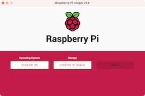
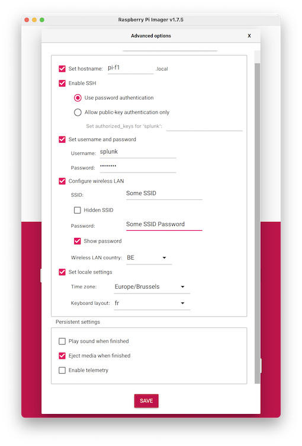
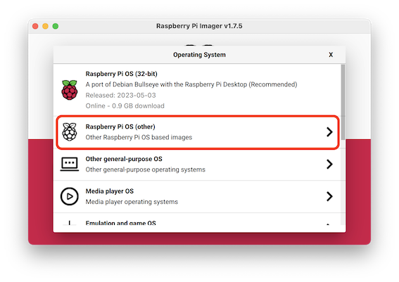
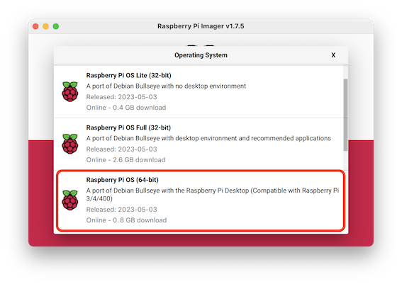
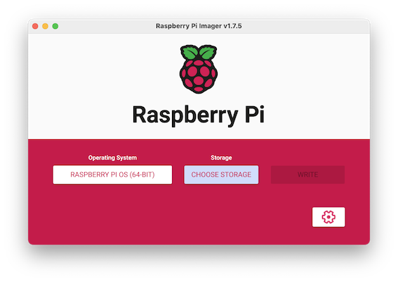

# splunk_f1_2022

## Raspberry preparation

### Create the SD Card

Launch the [Raspberry Pi Imager](https://www.raspberrypi.com/software/)



Prepare the configuration



Choose another OS (not the 32 bits version)



Choose the full 64 bits version



Chosse the Storage, and start writing



### Setup Networking

Add the expected fixed IP address to the Ethernet port in `sudo` mode:

```sh
cat <<EOF > /etc/network/interfaces.d/f1
auto eth0:1
iface eth0:1 inet static
    address 192.168.10.1
    netmask 255.255.255.0
EOF
```

and start the new ( virtual ) interface:

```sh
/sbin/ifup eth0:1
```

## Ingest script for O11y and Core/Enterprise

Create and activate virtual Python environment:

```sh
#!/bin/bash
python3 -m venv .venv
source .venv/bin/activate
pip install -r requirements.txt
```

Edit `settings.ini`

```ini
[ingest_settings]
debug = True
sim_token = xxx
ingest_endpoint = https://ingest.{REALM}.signalfx.com
splunk_hec_ip = https://hec_endpoint
splunk_hec_port = 8088
splunk_hec_token = xxx

[telemetry_settings]
motion = True
telemetry = True
lap = True
status = True
```

## Splunk DataDrivers

Usage:

```sh
F1_2022_Conference_ingest.py [-h] [--hostname HOSTNAME]
                                  [--player PLAYER] [--port PORT]
                                  [--o11y {yes,no}] [--splunk {yes,no}]
                                  [--mode {spectator,solo}]
```

Options:

```sh
  -h, --help              show this help message and exit
  --hostname HOSTNAME     Hostname
  --player PLAYER         Player Name
  --port PORT             UDP Port
  --o11y {yes,no}         Send data to O11y Cloud
  --splunk {yes,no}       Send data to Splunk Enterprise/Cloud
  --mode {spectator,solo} Spectator or Solo Mode
```

Example:

```python F1_2022_Conference_ingest.py --o11y yes --mode solo --player EventPrefix_PlayerName```

## Execution

### Splunk side

- Open splunk dashboard <https://dddemo.notsplunktshirtco.com/en-GB/app/sim_racing/best_lap_of_the_day__2022>
- Log in with your credentials
- Edit Splunk enterprise dashboard to only show `EventPrefix_PlayerName`:
- Open O11y dashboard: <https://app.us1.signalfx.com/#/dashboard/Ffb7BDSA4AE?groupId=Ffb5pHKA0AA&configId=Ffb7BDlA0AA>
- Start PS4

### Playstation side

Network setup manual via LAN:

- IP manual
- IP: 192.168.10.2
- Subnet mask: 255:255:255:0
- All other next (default option)

Launch game:

- Go to settings -> telemetry settings
- Telemetry settings -> send to 192.168.10.1 ( Raspberry )

### Raspberry side

Login:
`ssh splunk@192.168.10.1`
or
`ssh splunk@pi-f1.local`
and `changeme`.

Go To folder:
`cd splunk_f1_2022`

Check credentials in `settings.ini` file

Start the virtual environment: `source .venv/bin/activate`

#### Legacy Script

For every person that races start and stop the script:

`python3 F1_2022_Conference_ingest.py --hostname MyHost --o11y yes --splunk yes --mode solo --player EventPrefix_PlayerName
`

#### Alternative Script

Alternatively, a small `bash` script is available:

`./start.sh`

You have to enter the player's name at the prompt and it will launch the ingest.

Press `ctrl-c` to stop the collection for that player and start over with a new player.

Enter `exit` at the prompt to quit the script
